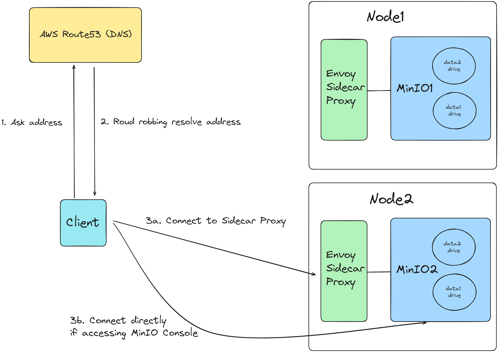

# object-storage-prototype

Hosting S3 Compatible Object Storage using MinIO and Envoy proxy inside Docker. This deployment establish a distributed setup of MinIO that has multiple nodes and multiple drives per node. Each MinIO node has 1 side car Envoy proxy that is used to handle SSL termination. This proxy is added since MinIO cannot support latest TLS protocol and causes issues when installing certificates. Lastly, the docker network mode is set to host mode to improve the performance of network speed.

For scaling traffic, it's recommend to use **DNS-based load balancing**. A easy round robbin dns load balancing is sufficient to tackle large amount of download traffic. The bottleneck is usually not the CPU/Memory but the **network bandwidth and disk IO** of the host machine. Make sure you find a vendor that can provide high network bandwidth and disk IO.

A breif overview of the deployment is shown below:



## **Prerequisites**

- Have `docker` and `docker-compose` installed.
- Have a keyboard for you to type command.
- Chill enough.

## **Configuration**

### **Environment Variable**

Docker will read environment variables from the `.env` file and use them to configure the application.
This file is not committed to the repository and is used to store sensitive information such as API keys and secrets.
Here is an example of the `.env` file:

```shell
# Set the hosts and volumes MinIO uses at startup
# The command uses MinIO expansion notation {x...y} to denote a
# sequential series.
#
# The following example covers 2 MinIO hosts
# with 2 drives each at the specified hostname and drive locations.
# The command can include the port that each MinIO server listens on
# (default 9000)
#
MINIO_HOST_URLS=http://minio{1...2}.xxxx.com/data{1...2}

# For running on localhost, you should use relative path such as
# MINIO_HOST_URLS=/data{1...2}
# Note that you should run it on Linux since docker network host mode  cannot work on Windows.

# MINIO_ROOT_USER and MINIO_ROOT_PASSWORD sets the root account for the MinIO server.
# This user has unrestricted permissions to perform S3 and administrative API operations on any resource in the deployment.
# Omit to use the default values 'minioadmin:minioadmin'.
# MinIO recommends setting non-default values as a best practice, regardless of environment.
MINIO_ROOT_USER=minioadmin
MINIO_ROOT_PASSWORD=xxxxxxxx
```

For detail setup of MinIO, please refer to [MinIO documentation](https://github.com/minio/minio/tree/master/docs/docker)
and [MinIO Distributed Setup](https://github.com/minio/minio/tree/master/docs/distributed#expanding-existing-distributed-setup).


### **Setup SSL Certificates**

The SSL certificates should be placed in the `certs` directory. Those will be copied into envoy proxy container and used to terminate SSL traffic. The certificates should be named `private.key` and `public.cert` for the private key and certificate respectively.


### **Setup DNS**

You should have a DNS server that resolves the domain name to the IP address of the host machine. This is required for the SSL certificates to work properly. The domain name should be set in the `.env` file and the `envoy.yaml` file. Also, as mentioned above, you should have a DNS-based load balancer to distribute the traffic among the MinIO nodes.

## **Run the Application**

To run the application, execute the following command:

```shell
docker-compose up -d
docker-compose logs -f # view logs
```

Now you can access console at `http://[YOUR_DOMAIN_NAME]:9001` and login with the credentials you set in the `.env` file.
The default API endpoint is `https://[YOUR_DOMAIN_NAME]:9000`.
